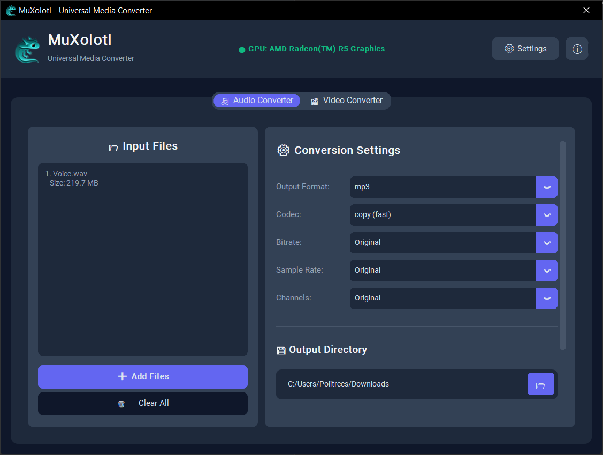
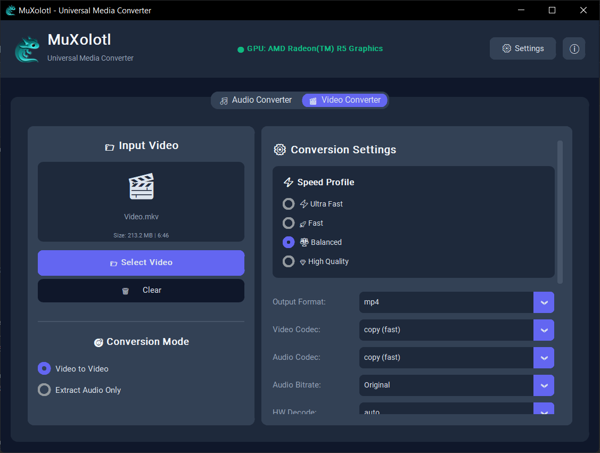
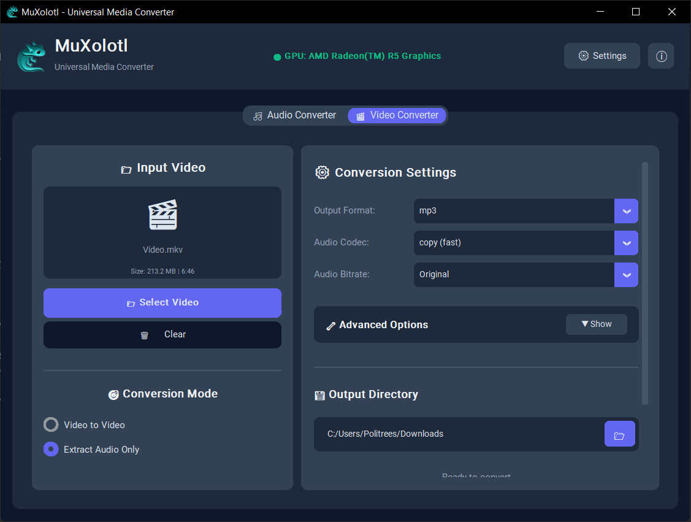
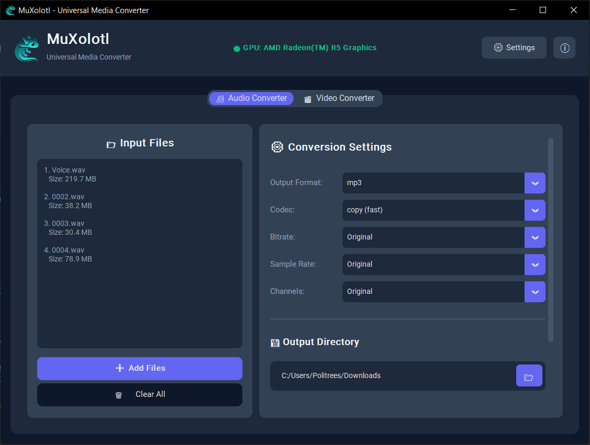

<div align="center">


# MuXolotl

### Universal Media Converter with Hardware Acceleration

[](https://github.com/Politrees/MuXolotl/releases)
[](https://www.python.org/downloads/)
[](LICENSE)
[](https://github.com/Politrees/MuXolotl)

**A powerful, flexible, and lightning-fast media converter supporting hundreds of audio and video formats with GPU acceleration.**

[Features](#-features) • [Installation](#-installation) • [Usage](#-usage) • [Contributing](#-contributing)

</div>

---

## 📋 Table of Contents

- [✨ Features](#-features)
- [🎮 Hardware Acceleration](#-hardware-acceleration)
- [📦 Installation](#-installation)
  - [Windows](#windows)
  - [Linux](#linux)
  - [macOS](#macos)
- [🚀 Quick Start](#-quick-start)
- [📖 Usage](#-usage)
  - [Audio Conversion](#audio-conversion)
  - [Video Conversion](#video-conversion)
  - [Batch Processing](#batch-processing)
- [🎯 Supported Formats](#-supported-formats)
- [⚙️ Advanced Settings](#️-advanced-settings)
- [🐛 Troubleshooting](#-troubleshooting)
- [🤝 Contributing](#-contributing)
- [📝 License](#-license)
- [🙏 Acknowledgments](#-acknowledgments)

---

## ✨ Features

### 🎵 Audio Conversion
- **30+ Audio Formats** - MP3, FLAC, WAV, OGG, Opus, AAC, ALAC, WMA, and more
- **Quality Presets** - From ultra-compressed to lossless
- **Advanced Controls** - Bitrate, sample rate, channels, codecs
- **Metadata Preservation** - Keep all your tags and artwork
- **Batch Processing** - Convert multiple files at once

### 🎬 Video Conversion
- **25+ Video Formats** - MP4, MKV, AVI, MOV, WebM, FLV, and more
- **GPU Acceleration** - NVIDIA, AMD, Intel, and Apple Silicon support
- **Speed Profiles** - Ultra Fast, Fast, Balanced, High Quality
- **Resolution Control** - 4K, 2K, 1080p, 720p, custom sizes
- **Audio Extraction** - Extract audio from video files
- **Smart Codec Selection** - Automatic best codec detection

### 🚀 Performance
- **Hardware Encoding** - Up to **15x faster** than CPU-only converters
- **Multi-threaded** - Utilizes all CPU cores efficiently
- **Real-time Progress** - See speed, ETA, and progress
- **Cancellable Operations** - Stop anytime without corrupting files

### 🎨 User Interface
- **Modern Dark Theme** - Easy on the eyes
- **Drag & Drop** - Simply drag files to convert
- **Tooltips Everywhere** - Hover for helpful explanations
- **Live Preview** - See file info before converting
- **Status Indicators** - Know what's happening at a glance

---

## 🎮 Hardware Acceleration

MuXolotl automatically detects and uses your GPU for **blazing-fast conversions**:

| GPU Brand      | Encoder     | Speedup       | Quality   |
|---------------|--------------|---------------|-----------|
| 🟢 **NVIDIA** | NVENC        | 10-15x        | Excellent |
| 🔴 **AMD**    | AMF          | 5-10x         | Very Good |
| 🔵 **Intel**  | Quick Sync   | 5-12x         | Very Good |
| 🍎 **Apple**  | VideoToolbox | 8-12x         | Excellent |
| 💻 **CPU**    | libx264/265  | 1x (baseline) | Best      |

> **Note:** GPU encoding prioritizes speed while maintaining excellent quality. For absolute maximum quality, CPU encoding is still king, but much slower.

---

## 📦 Installation

### Prerequisites

**FFmpeg** is required. MuXolotl uses FFmpeg for all conversions.

#### Windows

1. **Install FFmpeg:**
   - Download from [ffmpeg.org](https://ffmpeg.org/download.html)
   - Or use [Chocolatey](https://chocolatey.org/):
     ```bash
     choco install ffmpeg
     ```

2. **Install MuXolotl:**
   ```bash
   # Download the latest release
   git clone https://github.com/Politrees/MuXolotl.git
   cd MuXolotl

   # Install dependencies
   pip install -r requirements.txt

   # Run
   python main.py
   ```

#### Linux

```bash
# Install FFmpeg (Ubuntu/Debian)
sudo apt update
sudo apt install ffmpeg

# Install FFmpeg (Fedora)
sudo dnf install ffmpeg

# Install FFmpeg (Arch)
sudo pacman -S ffmpeg

# Install MuXolotl
git clone https://github.com/Politrees/MuXolotl.git
cd MuXolotl
pip install -r requirements.txt
python main.py
```

#### macOS

```bash
# Install FFmpeg via Homebrew
brew install ffmpeg

# Install MuXolotl
git clone https://github.com/Politrees/MuXolotl.git
cd MuXolotl
pip3 install -r requirements.txt
python3 main.py
```

### Dependencies

```txt
customtkinter>=5.2.0
pillow>=10.0.0
```

---

## 🚀 Quick Start

### 1. Launch MuXolotl

```bash
python main.py
```

### 2. Convert Your First File

#### Audio Conversion (WAV → MP3):
1. Click **🎵 Audio Converter** tab
2. Click **➕ Add Files** and select your WAV file
3. Select **MP3** as output format
4. Click **🚀 START CONVERSION**

#### Video Conversion (MKV → MP4):
1. Click **🎬 Video Converter** tab
2. Click **📂 Select Video** and choose your MKV file
3. Select **MP4** as output format
4. Choose a speed profile (e.g., **⚖️ Balanced**)
5. Click **🚀 START CONVERSION**

### 3. Find Your Converted Files

By default, files are saved to your **Downloads** folder (customizable in settings).

---

## 📖 Usage

### Audio Conversion

<p></p>

#### Basic Workflow:
1. **Add Files** - Click ➕ or drag & drop
2. **Choose Format** - MP3, FLAC, WAV, etc.
3. **Select Codec** - Auto (recommended) or specific
4. **Set Bitrate** - Higher = better quality + larger file
5. **Convert** - Click 🚀 START CONVERSION

#### Common Tasks:

**Convert to MP3 (320kbps):**
- Format: `MP3`
- Codec: `auto (recommended)`
- Bitrate: `320k`

**Convert to FLAC (lossless):**
- Format: `FLAC`
- Codec: `flac`
- Bitrate: `Original`

**Convert to Opus (best quality/size ratio):**
- Format: `OPUS`
- Codec: `libopus`
- Bitrate: `128k`

---

### Video Conversion

<p align="center">
  
  
</p>

#### Speed Profiles:

| Profile             | Speed       | Quality   | Use Case                |
|---------------------|-------------|-----------|-------------------------|
| ⚡ **Ultra Fast**   | 3-5x faster | Good      | Quick previews, testing |
| 🚀 **Fast**         | 2x faster   | Very Good | Most conversions        |
| ⚖️ **Balanced**     | Normal      | Excellent | Default choice          |
| 💎 **High Quality** | 50% slower  | Best      | Archival, masters       |

#### Common Tasks:

**Convert MKV to MP4 (balanced):**
1. Select file
2. Format: `MP4`
3. Video Codec: `auto (recommended)`
4. Audio Codec: `auto (recommended)`
5. Profile: `⚖️ Balanced`

**Compress 4K video to 1080p:**
1. Select file
2. Format: `MP4`
3. Click **🔧 Advanced Options** → **▼ Show**
4. Resolution: `1920x1080 (FHD)`
5. Profile: `🚀 Fast`

**Extract audio from video:**
1. Select video file
2. Mode: `Extract Audio Only` (radio button)
3. Format: `MP3` (or any audio format)
4. Audio Bitrate: `192k`

---

### Batch Processing

<p></p>

#### Audio Batch:
1. Click **➕ Add Files**
2. Select **multiple files** (Ctrl+Click / Cmd+Click)
3. Configure settings once
4. Click **🚀 START CONVERSION**
5. All files will be converted with the same settings

> **Tip:** Progress shows "Converting 3/10: filename.mp3" for batch operations

---

## 🎯 Supported Formats

### Audio Formats (30+)

| Format     | Extension       | Type         | Quality   |
|------------|-----------------|--------------|-----------|
| MP3        | `.mp3`          | Lossy        | Good      |
| FLAC       | `.flac`         | Lossless     | Perfect   |
| WAV        | `.wav`          | Uncompressed | Perfect   |
| OGG Vorbis | `.ogg`, `.oga`  | Lossy        | Very Good |
| Opus       | `.opus`         | Lossy        | Excellent |
| AAC        | `.aac`, `.m4a`  | Lossy        | Very Good |
| ALAC       | `.m4a`          | Lossless     | Perfect   |
| WMA        | `.wma`          | Lossy        | Good      |
| AIFF       | `.aiff`, `.aif` | Uncompressed | Perfect   |
| AC3        | `.ac3`          | Lossy        | Good      |
| DTS        | `.dts`          | Lossy        | Very Good |
| APE        | `.ape`          | Lossless     | Perfect   |
| TTA        | `.tta`          | Lossless     | Perfect   |
| WavPack    | `.wv`           | Lossless     | Perfect   |

**+ more:** AMR, AU, CAF, MKA, MP2, Speex, and more...

### Video Formats (25+)

| Format  | Extension       | Codecs               | Use Case                |
|---------|-----------------|----------------------|-------------------------|
| MP4     | `.mp4`, `.m4v`  | H.264, H.265, MPEG-4 | Universal compatibility |
| MKV     | `.mkv`          | Any                  | Best for archival       |
| AVI     | `.avi`          | H.264, MPEG-4, DivX  | Legacy compatibility    |
| MOV     | `.mov`          | H.264, ProRes        | Apple devices           |
| WebM    | `.webm`         | VP9, VP8, AV1        | Web video               |
| FLV     | `.flv`          | H.264, Flash         | Streaming               |
| MPEG    | `.mpeg`, `.mpg` | MPEG-2, MPEG-1       | DVD/TV                  |
| WMV     | `.wmv`, `.asf`  | WMV                  | Windows Media           |
| 3GP     | `.3gp`, `.3g2`  | H.264, H.263         | Mobile devices          |
| TS/M2TS | `.ts`, `.m2ts`  | H.264, MPEG-2        | Broadcasting            |

**+ more:** MXF, VOB, F4V, DivX, and more...

---

## ⚙️ Advanced Settings

### Audio Advanced Options

**Codec Selection:**
- `auto (recommended)` - Smart codec selection
- `copy (fast)` - No re-encoding (instant, if compatible)
- Specific codecs - Manual selection

**Sample Rate:**
- `Original` - Keep source sample rate
- `44100 Hz` - CD quality
- `48000 Hz` - Professional/video standard
- `96000 Hz` - Hi-res audio

**Channels:**
- `Original` - Keep source channels
- `Mono` - Single channel (smaller files)
- `Stereo` - Two channels (standard)

### Video Advanced Options

**CRF (Constant Rate Factor):**
- Lower = better quality + larger file
- `18` - Visually lossless
- `23` - Balanced (default)
- `28` - Lower quality, smaller file

**Hardware Acceleration:**
- `auto` - Automatic detection (recommended)
- `cuda` - NVIDIA GPUs
- `qsv` - Intel Quick Sync
- `d3d11va` - AMD on Windows
- `videotoolbox` - Apple Silicon/Mac
- `none` - CPU only

**Presets (x264/x265):**
- `ultrafast` - Fastest, largest file
- `veryfast`, `fast` - Fast encoding
- `medium` - Balanced (default)
- `slow`, `slower` - Better compression

---

## 🐛 Troubleshooting

### FFmpeg Not Found

**Symptoms:** Error on startup: "FFmpeg is not available"

**Solution:**
```bash
# Verify FFmpeg installation
ffmpeg -version

# If not found, install:
# Windows (Chocolatey):
choco install ffmpeg

# Linux (Ubuntu):
sudo apt install ffmpeg

# macOS (Homebrew):
brew install ffmpeg
```

---

### Conversion Fails

**Symptoms:** "All codec attempts failed"

**Solution:**
1. Check input file isn't corrupted:
   ```bash
   ffmpeg -i input.mkv -f null -
   ```
2. Try different output format
3. Check logs in `logs/muxolotl_YYYYMMDD.log`
4. Report bug with log file

---

### No GPU Acceleration

**Symptoms:** Shows "CPU encoding only" despite having GPU

**Solution:**
1. **Update GPU drivers** (most common fix)
2. Check FFmpeg has GPU support:
   ```bash
   ffmpeg -hwaccels
   ```
3. Manually select hwaccel in Advanced Settings
4. Some GPUs (old models) may not be supported

---

### Audio/Video Out of Sync

**Symptoms:** Converted video has desynchronized audio

**Solution:**
1. Use `copy` for audio codec if video is being re-encoded
2. Try different output format (MKV is more tolerant)
3. Report issue with sample file

---

### Permission Errors

**Symptoms:** "Permission denied" when saving

**Solution:**
1. Choose different output directory
2. Run with proper permissions (avoid system folders)
3. Check antivirus isn't blocking

---

## 🤝 Contributing

Contributions are welcome! Here's how you can help:

### Reporting Bugs

1. Check [existing issues](https://github.com/Politrees/MuXolotl/issues)
2. Create new issue with:
   - MuXolotl version
   - Operating system
   - Steps to reproduce
   - Log file (`logs/muxolotl_YYYYMMDD.log`)

### Suggesting Features

Open an issue with tag `enhancement` describing:
- What feature you want
- Why it's useful
- How it should work

### Code Contributions

1. Fork the repository
2. Create feature branch (`git checkout -b feature/amazing-feature`)
3. Commit changes (`git commit -m 'Add amazing feature'`)
4. Push to branch (`git push origin feature/amazing-feature`)
5. Open [Pull Request](https://github.com/Politrees/MuXolotl/pulls)

---

## 🗺️ Roadmap

### Version 0.1.0 (Next Release)
- [ ] Preset system (save favorite settings)
- [ ] Queue management (pause, reorder, resume)
- [ ] Video preview before conversion
- [ ] Subtitle support
- [ ] Multi-language interface

### Version 0.2.0
- [ ] Batch editor (apply different settings per file)
- [ ] Video trimming/cutting
- [ ] Audio normalization
- [ ] GPU usage monitoring

### Future Considerations
- [ ] Cloud conversion support
- [ ] Mobile companion app
- [ ] Plugin system
- [ ] Video effects/filters
- [ ] Built-in video player

---

## 📝 License

This project is licensed under the **MIT License** - see the [LICENSE](LICENSE) file for details.

---

## 🙏 Acknowledgments

MuXolotl wouldn't be possible without these amazing projects:

- **[FFmpeg](https://ffmpeg.org/)** - The backbone of all media processing
- **[CustomTkinter](https://github.com/TomSchimansky/CustomTkinter)** - Beautiful modern UI framework
- **[Python](https://www.python.org/)** - The language that powers it all
- **[Pillow](https://python-pillow.org/)** - Image processing library

Special thanks to:
- All contributors and testers
- The open-source community
- Everyone who reported bugs and suggested features

---

## 📊 Project Stats


---

## 📞 Support

- **Issues:** [GitHub Issues](https://github.com/Politrees/MuXolotl/issues)
- **Email:** politrees@example.com

---

<div align="center">

**Made with ❤️ by [Politrees](https://github.com/Politrees)**

If you find MuXolotl useful, consider giving it a ⭐ on GitHub!

[⬆ Back to Top](#-muxolotl)

</div>
